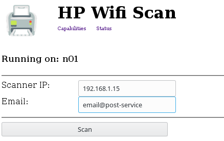

# HPWifiScan-GUI

- simple HTML interface for scanning documents on HP Network multifunction printers

- requires
    - PHP 7
    - HPWifiScan (https://github.com/petrj/HPWifiScan)
- optionally
    - sending scanned documents to email by PHPMailer (https://github.com/PHPMailer/PHPMailer)

---

